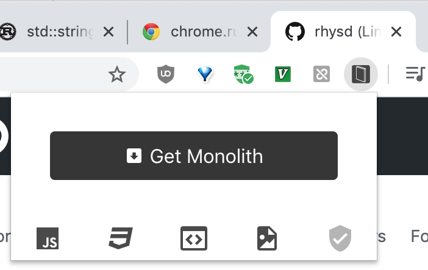

'Monolith of Web': Chrome Extension Port of [Monolith][1]
=========================================================

['Monolith of Web'][6] is a Chrome extension ported from CLI tool [Monolith][1]. Monolith is a CLI tool to
download a web page as static single HTML file. 'Monolith of Web' provides the same functionality as
a browser extension by compiling Monolith (written in Rust) into WebAssembly.

[Video on Youtube][2]

## Installation

- Install from [Chrome Web Store][7]
- Download `.crx` file from [releases page][5] and install it manually

## Usage

1. Go to a web page you want to store
2. Click 'Monolith of Web' icon in a browser bar (above popup window will open)
3. Click 'Get Monolith' button
4. Wait for the process completing
5. The generated single static HTML file is stored in your downloads folder

By toggling icons at bottom of the popup window, you can determine to or not to include followings
in the generated HTML file.

- JavaScript
- CSS
- `<iframe/>`
- Images

The button at right-bottom toggles if allow CORS request or not. Please read following 'Permissions'
section and 'CORS Requests in Background Page' section for more details.

## Permissions

- **Required permissions**
  - `activeTab`: This extension gets an HTML text and a page title from the active tab to generate a monolith
  - `storage`: This extension remembers the last state of toggle buttons at bottom in the popup window.
- **Optional permissions**
  - `http://*/*` and `https://*/*`: Allow any cross-origin requests in background page. This is runtime
    permission so this extension does not require by default. **Only when you see a broken HTML file is
    generated due to CORS error in background page, please enable this option.** The reason of these
    permissions are explained in next 'CORS Requests in Background Page' section.

## CORS Requests in Background Page

This extension generates a single HTML file in background page of Chrome extension. Since CSP in a
content script is not applied in a background page, some resources in content's HTML cannot be fetched
in background page.

By default, this extension ignores CORS errors in background page. It is usually not a problem since
resources protected by CSP are usually scripts which don't affect main content. But a broken single HTML
page may be generated due to CORS errors.

When you see a broken page due to the CORS error in background page, please enable 'allow CORS requests'
button at right-bottom in the popup window. Permission dialog will appear to require permissions for
sending CORS requests in background page. After accepting it, CORS request error is disabled and all
resources should be fetched with no error.

After generating a single HTML file with the runtime permissions, this extension will remove the permissions
as soon as possible for security.

## Development

WebAssembly port of Monolith is developed in [the forked repository][4]. Currently it has some differences
and duplicates against the original repository. reqwest did not support Wasm before 0.10.0 so my Wasm
port does not use it and uses `fetch()` directly via `js_sys` and `web_sys` crate.

This repository adds the forked Monolith repository as a Git submodule and uses it by bundling sources
with Webpack.

## Contributing

### Creating an issue

Before reporting an issue, please try the same URL with [CLI version][1]. If it is reproducible with
CLI version, please report it to the CLI repository at first.

If it is not reproducible with CLI version (it means the issue only occurs with this extension), please
report it from [issues page][8].

### Improve Wasm part

This repository only includes TypeScript part of extension. Wasm part is developed in
[forked monolith repository][4]. If your improvement can be applied to [upstream][1], please make a
pull request in the upstream at first. After the pull request is merged, please make an issue to
request to merge upstream at this repository or the forked repository.

## License

Distributed under [the MIT license](LICENSE).

[1]: https://github.com/Y2Z/monolith
[2]: https://www.youtube.com/watch?v=xBIrFlYE1W0
[3]: https://chrome.google.com/webstore/detail/koalogomkahjlabefiglodpnhhkokekg
[4]: https://github.com/rhysd/monolith
[5]: https://github.com/rhysd/monolith-of-web/releases
[6]: https://github.com/rhysd/monolith-of-web
[7]: https://chrome.google.com/webstore/detail/monolith/koalogomkahjlabefiglodpnhhkokekg
[8]: https://github.com/rhysd/monolith-of-web/issues
